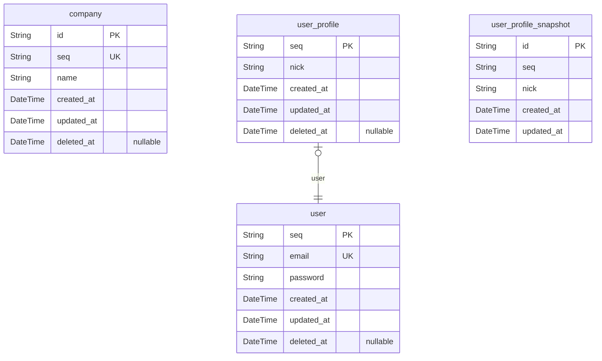

# cback ERD
> Generated by [`prisma-markdown`](https://github.com/samchon/prisma-markdown)

- [default](#default)

## default

### `user`

**Properties**
  - `seq`: User seq
  - `email`: User email (user id)
  - `password`: User password
  - `created_at`: User created
  - `updated_at`: User updated
  - `deleted_at`: User deleted

### `company`

**Properties**
  - `id`: Company seq
  - `seq`: 사업자 번호
  - `name`: 회사명
  - `created_at`: company created
  - `updated_at`: company updated
  - `deleted_at`: company deleted

### `user_profile`

**Properties**
  - `seq`: seq
  - `nick`: nick
  - `created_at`: updated at
  - `updated_at`: updated at
  - `deleted_at`: deleted at

### `user_profile_snapshot`

**Properties**
  - `id`: 
  - `seq`: seq
  - `nick`: nick
  - `created_at`: updated at
  - `updated_at`: updated at